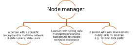

[[introduction6]]
== What is the recommended process for establishing a Participant node?

Establishing a Participant node involves a number of critical decisions that will impact its effectiveness, which therefore deserve careful consideration from the beginning. These decisions mostly apply to country Participants, although some extend to organizations when there are several networked institutions in which a node could potentially be based. The process is typically influenced by factors specific to the Participant’s context including:

. The institutional landscape at the Participant level: the number and type of institutions involved with biodiversity, roles, social and economic context, research tradition, etc.
. The interests, needs, and priorities of the Participant with regard to biodiversity data and information +
. The current and potential capacity of the Participant, in terms of funding, infrastructure, staff, etc.

While these factors vary considerably between Participants, lessons from the community can help new GBIF Participants, or those going through strategic changes in their decision-making processes. <<box-4,Box 4>> shows a simplified participatory approach towards making some of the key decisions necessary to establish an effective node.

The key recommendation is to start a participatory process at the Participant level, ideally led by the Head of Delegation or the institution that has been given the responsibility to sign the GBIF Memorandum of Understanding. This process should include discussing the long-term vision and mission for the Participant node, and formulating a recommendation for the node’s establishment. It can be useful to begin by envisaging the scope of the biodiversity information facility required by the Participant, rather than looking at the role of the coordinating node in isolation. An effective first step is for the Head of Delegation or lead institution to convene a group of representatives from the Participant’s key biodiversity stakeholder institutions, helping to ensure their ownership of the process from the beginning.

*See <<box-4,box 4>>*

Many tools exist to support dialogue around the establishment of a Participant node. We recommend carrying out a https://www.gbif.org/tool/6Y2SqK8XokHUqIFUn6TLxX/[capacity self-assessment] (see <<section 5.2>>) to identify the key capacity strengths and needs, and from which to measure progress in future. A preliminary https://www.gbif.org/document/80890[content needs assessment] conducted at the Participant level through a survey, workshop or literature analysis (possibly led by a consultant) can provide valuable information to guide the stakeholder group in formulating their recommendations. This assessment helps ensure that the needs and priorities of a broad stakeholder group are represented in the process. Stakeholder mapping can also shape an understanding how the biodiversity information facility and node will address the Participant’s needs and priorities, and complement other biodiversity-related or information-related initiatives.

After defining the scope of a biodiversity information facility and the long-term vision and goals for its coordinating node, stakeholders are ready to discuss implementation plans for the node. These should include aspects such as the collaborative framework, infrastructure requirements, governance structure, funding, membership of governing and/or advisory bodies, the node’s roles and responsibilities, as well as the key decision on where to locate the node.

The following questions can help the process of establishing a node:

. Which of the identified needs should the node address, and which can the members of the wider stakeholder network serve?
. Which type of agreements (e.g., data sharing/use agreements, community norms, a formal mandate for the node) are needed to support effective collaboration between stakeholders?
. What type of informatics infrastructure provides the ideal model for a Participant biodiversity information facility? Are there intermediate stages in developing this infrastructure that would allow the provision of basic services as early as possible? Should the infrastructure rely on a distributed system, or should the node act as a central hub for the network?
. What type of governance structure should the node have? How can this help to create a sense of ownership in the node’s activities for the biodiversity information facility’s key stakeholders?
. Does the node require advisory bodies, like scientific committees?
. Which institutional location would provide the node with the best combination of neutrality and capacity to support key services?
. Which institutional location would provide the node with the greatest institutional and financial support, as well as the maximum long-term stability? (See <<Section 6.1>>).

When designing and implementing the process of establishing a node, new Participants are encouraged to seek regular advice and guidance directly from existing Participants and the Secretariat: past experience often helps to identify potential problems and find effective solutions.

Ideally, the results of this process should form the basis of the recommendations for establishing the Participant node (including formal aspects such as the legal mandate). The group of stakeholders convened to support this process may be encouraged to become the initial members of the node’s network and governing bodies.

Establishing a Participant node and biodiversity information facility is about changing the way individuals and institutions operate and cooperate. There is no single perfect solution, and choices will depend on the circumstances and priorities of each Participant. The more inclusive, transparent and participatory the process is, the greater the chances are that the node will effectively meet the Participant’s biodiversity information needs into the long term.

[[node-location-selection]]
=== How should a GBIF Participant select the institutional location for a node?

As discussed above, the institutional location for the node is a critical decision likely to have long-term impacts on its effectiveness in coordinating biodiversity information for the country. <<Table 1>> summarizes the types of institutions previously designated as hosts of GBIF Participant nodes, as well as some of the potential advantages and disadvantages associated with each type of host. Focused mainly on countries rather than organizations, the table does not provide a single recommendation on where to locate a node but can serve as a reference while considering options. These examples are generalized and will vary greatly depending on the specific situation of the Participant. The potential disadvantages in the right-hand column may not be applicable to all countries or host institutions. 

In addition to choosing the location of the node, Participants need to decide the position of the node team within the host institution: will it be an autonomous body with an independent mandate, a dedicated section or department of the host institution, or a group of staff members sharing their node responsibilities with other functions? New Participants are advised to consult with colleagues in the network and examine https://www.gbif.org/the-gbif-network[the country profiles on GBIF.org] to help identify the most appropriate model for national circumstances.

As a final note, some GBIF Participants have chosen to divide their node team among several host institutions. In such cases, Participants are advised to designate one institution to coordinate node activity and act as the main contact point for interactions with the GBIF Secretariat and the global network. Only one representative per Participant may be appointed to the Participant Node Managers Committee.

.Generalized examples of the types of institutions designated as hosts of GBIF Participant nodes.
[cols=2*a,options="header"]
|===

^|Potential advantages

^|Potential disadvantages

2+^s|Natural history collections

|Existing knowledge of the challenges and requirements of digitizing and managing natural history data

|May take significant effort to demonstrate neutrality (e.g., if it is
a zoological collection, that it can work with other types of collections),
or that it is not competing for digitization funds, etc.

May find difficulty in engaging with other communities holding other types
of biodiversity data (e.g., observations, ecological data, etc.)

Can make it difficult for the node to serve the needs of some stakeholders
(e.g., policymakers)

2+^s|Ministries of science, environment, et al.

|Very strong mandate and capacity to influence and support policy and decision making

Easily aligned with national biodiversity policies, strategies, and programme

|Challenges to operate at the technical level and to provide technical
support (e.g., to the scientific community)

Easily affected by political changes

May find difficulties in addressing needs from other ministries (e.g.,
from science or environment)

2+^s|Biodiversity or biological research institutes

|High potential for developing capacity in biodiversity informatics easily and quickly

Full knowledge of the biodiversity-research realm

May have a strong and clear institutional mandate

|May not be perceived as neutral by all stakeholders, depending on how
the institute fits within the Participant’s overall institutional landscape
(for example, if there is overlap or competition for resources)

2+^s|Research councils or science & technology commissions

|Excellent position to use the Participant node to coordinate, promote
and facilitate the mobilization of biodiversity data from research

Easily aligned with national research policies, strategies, and programmes

|May not be perceived as neutral by all stakeholders, depending on how
the institute fits within the Participant’s overall institutional landscape
(for example, if there is overlap or competition for resources)

2+^s|Non-governmental organizations

|Flexibility and autonomy

|Potential lack of mandate, difficulty in formally engaging with government
institutions

May become dependent on projects and project-based funding

2+^s|University departments or faculties

|High potential for developing capacity in biodiversity informatics easily
and quickly

Potential for aligning the node’s activities with various biodiversity
research agenda

|May face neutrality issues

May become dependent on projects and project-based funding

2+^s|National informatics facilities outside the biodiversity/ biological domain

|Strong position of neutrality

Ready access to technical capacity in informatics

Potentially useful connections with well-funded national priorities on
innovation and technology

|Need to invest in staff bringing relevant scientific domain knowledge
to work effectively with biodiversity data

Need to build contacts and knowledge of relevant institutional networks

|===

[[node-staff-roles]]
=== What are the recommendations on the staff roles within nodes?

While the specific services that nodes provide vary from one Participant to another (see <<Section 5>>), a node’s staff need to cover a number of typical functions:

* Management and coordination
* Outreach, communications, public relations and institutional networking (regional, national or thematic level)
* Fundraising and project writing
* Administrative work (financial management, reporting, organizing events and meetings etc.)
* Capacity enhancement
* Technical support service for data holders (helpdesk)
* ICT support, webmaster & database management
* Software development (data capture and cleaning tools, data visualization tools, data portal & web interfaces, web services, etc.)
* Data analysis & modelling
* Scientific liaison and promotion of data use in relevant research communities

This diversity of functions makes it clear that nodes require staff with a wide range of skills ranging from administrative support to expertise in biodiversity informatics. Deciding how to staff a node will, of course, depend on its expected roles, the level of financial support and the hosting agreement or institutional location of the node. In cases where nodes are integrated into larger institutions, functions like administrative tasks are often provided through in-kind support from the host. The institutional landscape at the Participant level will affect the importance given to particular skills: for example, where a node is coordinating a large number of biodiversity-related institutions, it will need greater emphasis on outreach and networking skills.

To cover the main functions listed above (assuming administrative support is provided by the host institution), Participants can consider at least the following four roles to ensure the node’s engagement with stakeholder communities, while providing the necessary technical skills to provide good technical support to data holders and users:

* A node manager as the manager of the team, responsible for the majority of the interactions with the GBIF network and Secretariat including representation on the Participant node managers’ committee. Nodes may either combine this role with one of the three below or, ideally, dedicate an individual exclusively to the position of node manager.
* A person with a scientific background, knowledge of the relevant research communities, and the ability to motivate and communicate with data holders, data users and those engaged in policy development
* A person with a background in biodiversity informatics, skills in data management, and the ability to provide technical assistance to data holders and data users while maintaining databases
* A person with an informatics background, able to develop and maintain an informatics infrastructure to enable biodiversity data publishing and support access to biodiversity data, for example, through a national data portal.

[[box-example-staff-roles]]
.Example of staff roles for a Participant node
****
This example assumes that the administrative roles are covered by the host institution.

****
