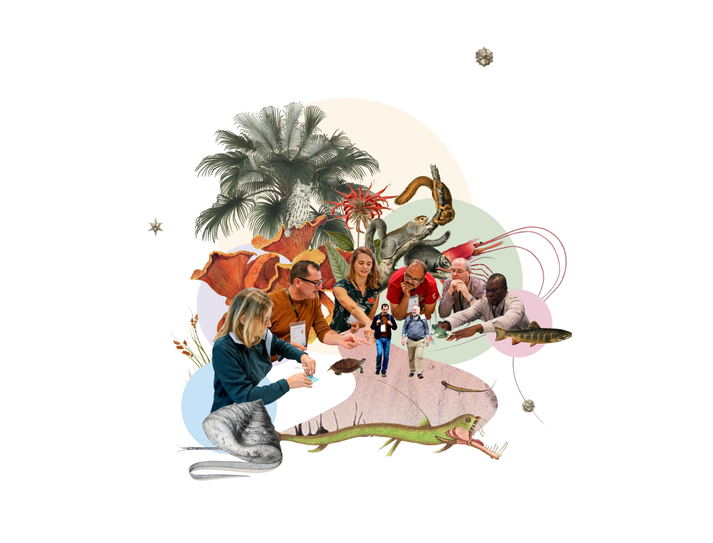

ifdef::backend-html5[]

endif::backend-html5[]

== Colophon

=== Suggested citation
GBIF Secretariat (2025) Establishing an Effective GBIF Participant Node: Concepts and general considerations. Copenhagen: GBIF Secretariat. https://doi.org/10.35035/doc-d601-d695.

=== Contributors
https://orcid.org/0000-0002-6158-8202[Mélianie Raymond^], https://orcid.org/0009-0004-6438-6536[Maheva Bagard Laursen^], https://orcid.org/0000-0002-1920-5298[Laura Anne Russell^], https://orcid.org/0000-0002-6590-599X[Kyle Copas^], https://orcid.org/0000-0002-5015-5807[Tim Hirsch^], https://orcid.org/0000-0003-3918-4065[Andrea Hahn^] and https://orcid.org/0000-0002-2685-8078[Marie Grosjean^]

=== Translators

==== link:../fr[French]
https://orcid.org/0000-0002-6718-6669[Carole Sinou^], https://orcid.org/0000-0002-7839-5300[André Heughebaert^], https://orcid.org/0000-0001-6597-8438[Pierre Radji^] and https://orcid.org/0000-0003-4736-7419[Sophie Pamerlon^]

==== link:../pt[Portuguese]
https://orcid.org/0000-0002-8351-4028[Rui Figueira^] and Joao Nicolau 

==== link:../es[Spanish]
Miguel Vega, https://orcid.org/0000-0003-3877-7408[Anabela Plos^], Patricia Ramos, https://orcid.org/0000-0003-2863-2491[William Ulate^] and https://orcid.org/0000-0001-9244-399X[Cristina Villaverde^]

=== Licence
_Establishing an Effective GBIF Participant Node_ is licensed under https://creativecommons.org/licenses/by-sa/4.0[Creative Commons Attribution-ShareAlike 4.0 Unported License^].

=== Persistent URI
https://doi.org/10.35035/doc-d601-d695

=== Document Control
Third edition published, May 2025.

Originally based on earlier publications: 

- _Establishing an Effective GBIF Participant Node: Concepts and general considerations_. https://doi.org/10.15468/doc-z79c-sa53[Version 2^] (2019) by https://orcid.org/0000-0002-6158-8202[Mélianie Raymond^], https://orcid.org/0000-0002-6590-599X[Kyle Copas^], https://orcid.org/0000-0002-5015-5807[Tim Hirsch^], https://orcid.org/0000-0003-3918-4065[Andrea Hahn^] and https://orcid.org/0000-0002-2685-8078[Marie Grosjean^]
- _Towards establishing a functional GBIF Participant Node (Part I): definitions and general considerations_. https://doi.org/10.15468/doc.fm4b-6q42[First edition^] (2015) by https://orcid.org/0000-0002-6158-8202[Mélianie Raymond], https://orcid.org/0000-0001-6197-9951[Olaf Bánki], https://orcid.org/0000-0002-6590-599X[Kyle Copas], Alberto González-Talaván, https://orcid.org/0000-0002-5015-5807[Tim Hirsch] and https://orcid.org/0000-0001-6492-4016[Donald Hobern].

=== Cover image

Illustration by Javier Gamboa, GBIF secretariat 2025, licensed under https://creativecommons.org/licenses/by/4.0/[CC BY]

<<<
